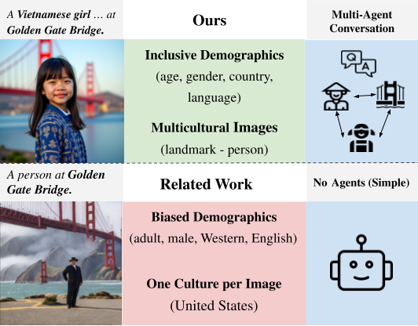

# When Cultures Meet: Multicultural Text-to-Image Generation

This repository contains the dataset and code for our paper: When Cultures Meet: Multicultural Text-to-Image Generation

## Data

The images and the corresponding image captions and demographic keywords can be accessed in 

## Models

The AltDiffusion and FLUX simple (Alt-S, Flux-S) and multi-agent models (Alt-M, Flux-M) are shown in this repository.
